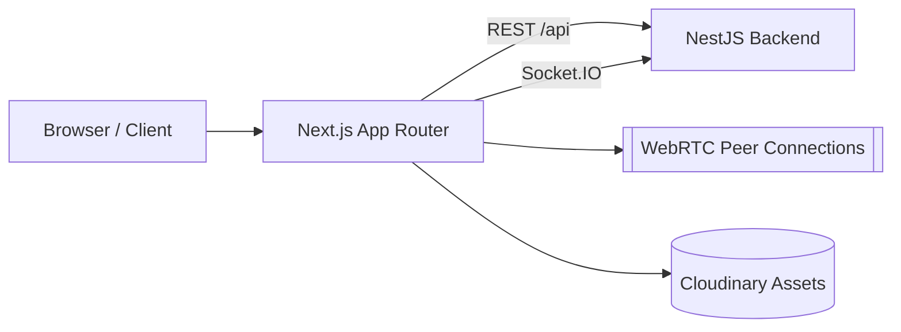
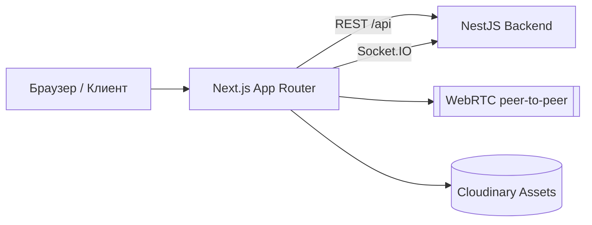

# DistaHilar — Frontend (Next.js 15 + TypeScript)

English | [Русский ниже](#русский)

Need the server? Visit the [DistaHilar Backend](../back/README.md).

## Overview

DistaHilar Frontend is a modern, Telegram‑inspired web messenger UI built with Next.js App Router. It features real‑time messaging, chat folders, reactions, media preview, WebRTC calls/live rooms, and full i18n support.

This is a personal, non‑commercial project for learning purposes. Product and interface ideas are inspired by the Telegram application; all trademarks belong to their respective owners.

## Features

- Auth flows (sign in / sign up)
- Real‑time updates via Socket.IO
- Chats list with search, unread counters, and previews
- Conversations with text, images, video, audio, files, replies, pins, reactions
- Media viewer and emoji picker
- Chat folders and management UI
- WebRTC calls (1:1) and “live rooms”
- Internationalization (EN/RU) with next‑intl
- Tailwind CSS styling, dark/light themes

## Tech Stack

- Next.js 15 (App Router), React 18, TypeScript
- Tailwind CSS + shadcn/ui primitives
- React Query, Redux Toolkit (with persist)
- Socket.IO client
- WebRTC APIs
- next‑intl (i18n), SCSS

## Architecture Diagram



## Project Structure (high level)

- `app/[locale]` — routes, layouts, and pages (`/auth`, `/chat`, `/chat/[chatId]`)
- `features` — domain features (chat list, folders, media, calls, etc.)
- `entities`/`widgets` — complex UI building blocks
- `shared` — providers (Socket), hooks (WebRTC, live), libs (axios, services), UI
- `prisma` — shared enums/models for type‑safety on the client

## Getting Started

### Prerequisites

- Node.js 18+

### Environment

Create `.env.local` in `front/`:

```env
NEXT_PUBLIC_BACKEND_URL=http://localhost:9555/api
NEXT_PUBLIC_WS_BACKEND_URL=http://localhost:9555

# Optional cookie settings (for cross‑domain deployments)
NEXT_PUBLIC_COOKIE_DOMAIN=localhost
NEXT_PUBLIC_COOKIE_SECURE=false
```

### Install and run

```bash
npm install
# optional: generate Prisma types for shared enums
npm run prisma:generate
npm run dev
```

Frontend will be available at:

```
http://localhost:3000
```

## Integration Notes

- The backend must allow CORS from the frontend origin and set `credentials: true`.
- Ensure the `NEXT_PUBLIC_BACKEND_URL` includes the `/api` prefix to match server routes.
- `NEXT_PUBLIC_WS_BACKEND_URL` must point to the Socket.IO server URL.

## License and Attribution

This repository is for educational purposes only. It is not affiliated with Telegram and is not intended for commercial use. Design and functionality are inspired by the Telegram application.

---

## Русский

### Описание

Frontend DistaHilar — это современный веб‑интерфейс мессенджера, вдохновлённый Telegram и построенный на Next.js (App Router). Он поддерживает обмен сообщениями в реальном времени, папки чатов, реакции, предпросмотр медиа, звонки и «живые» комнаты на WebRTC, а также полноценную i18n.

Это личный, некоммерческий проект для образовательных целей. Идеи дизайна и функционала вдохновлены приложением Telegram; все товарные знаки принадлежат их правообладателям.

### Функциональность

- Авторизация (вход/регистрация)
- Обновления в реальном времени через Socket.IO
- Список чатов с поиском, непрочитанными и превью сообщений
- Диалоги: текст, изображения, видео, аудио, файлы, ответы, закрепления, реакции
- Просмотр медиа, выбор эмодзи
- Папки чатов и их управление
- Звонки 1:1 и «живые» комнаты (WebRTC)
- Интернационализация (EN/RU) на next‑intl
- Tailwind CSS, светлая/тёмная темы

### Технологии

- Next.js 15 (App Router), React 18, TypeScript
- Tailwind CSS + shadcn/ui
- React Query, Redux Toolkit (+ persist)
- Socket.IO client
- WebRTC
- next‑intl, SCSS

### Архитектура



### Структура

- `app/[locale]` — маршруты и layout’ы (`/auth`, `/chat`, `/chat/[chatId]`)
- `features` — функциональные модули (список чатов, папки, медиа, звонки и т.д.)
- `entities`/`widgets` — составные части интерфейса
- `shared` — провайдеры (Socket), хуки (WebRTC, live), библиотеки (axios, сервисы), UI
- `prisma` — общие enum’ы/модели для типобезопасности на клиенте

### Быстрый старт

1. Установите зависимости:

```bash
npm install
```

2. (Опционально) сгенерируйте Prisma‑типы:

```bash
npm run prisma:generate
```

3. Запустите dev‑сервер:

```bash
npm run dev
```

Интерфейс доступен по адресу `http://localhost:3000`.

### Переменные окружения

См. пример `.env.local` выше: `NEXT_PUBLIC_BACKEND_URL`, `NEXT_PUBLIC_WS_BACKEND_URL`, а также опциональные `NEXT_PUBLIC_COOKIE_DOMAIN`, `NEXT_PUBLIC_COOKIE_SECURE` для кросс‑доменной работы.

### Интеграция с backend

- Разрешите CORS и cookie (`credentials: true`) со стороны сервера.
- Убедитесь, что `NEXT_PUBLIC_BACKEND_URL` содержит префикс `/api`.
- `NEXT_PUBLIC_WS_BACKEND_URL` должен указывать на Socket.IO сервер.

### Лицензия и атрибуция

Репозиторий предназначен только для обучения и не связан с Telegram. Проект не является коммерческим. Дизайн и функционал вдохновлены приложением Telegram.
